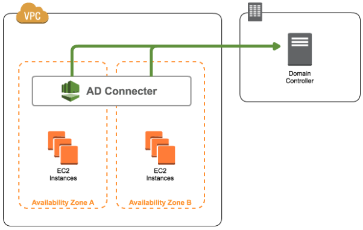
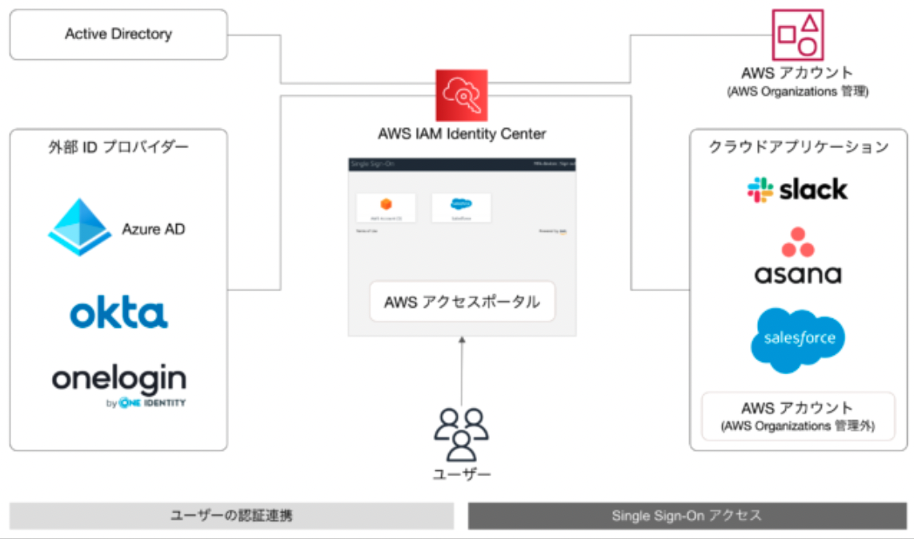
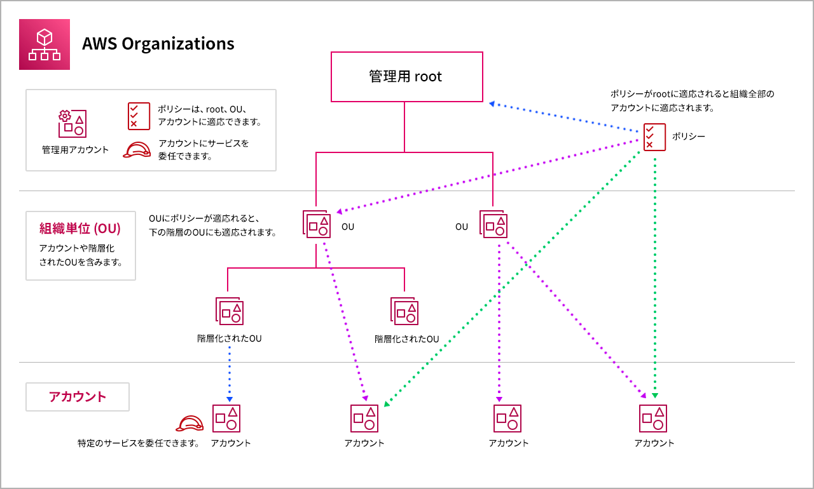
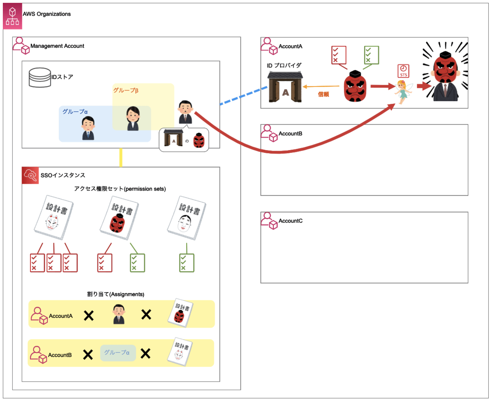

# アカウント
## クロスアカウント
複数のAWSアカウントを利用している組織に対する認証を管理する方法としてクロスアカウントアクセスがある。
これは、IAMユーザーを特定の管理アカウントで一元管理し、組織のAWSアカウントにはIAMロールを利用して、スイッチロースする方法。

具体的な設定方法としては、各組織側のIAM Roleの信頼ポリシーで管理アカウントのIAMユーザーに対してのSTSのアクション許可設定をしてあげる。

### サードパーティ製品へのクロスアカウント対応
サードパーティに対して、自分のAWSのIAM Roleを伝えることで、サードパーティのAWSユーザーやRoleがスイッチロールをして、自分のAWSを利用することが可能になる。

ただしこれには、混乱した代理問題という問題が発生する。
これは、サードパーティを利用している別のユーザーがIAM Role名を予測したりすることで、別のユーザーが自分のIAM Role権限を利用してしまうという問題。

これに対しては、サードパーティに対してIAM Roleを登録する際に、ランダム文字列などを発行して自分のAWSの信頼ポリシーの中のConditionにその文字列を追加することによって、対応する。

## AWS Directory Service
AWSの認証については、既に組織が管理している既存のActive Directoryと統合して共通利用することができる。  
ポイントは、オンプレや企業という単位でアカウントディレクトリを構築管理する点。
### AD Connector
ポイントはオンプレで利用しているActive Directoryの認証をそのまま利用できる点。
各AZにADConnectorを設定して、オンプレ側のADの情報を設定することで、IAM Roleが払い出されるイメージ

### Simple ADとManaged Microsoft AD
ポイントは、AWSへActive Directoryを移行する場合に利用することができる
- Simple AD  
    5000ユーザーまでの場合は利用する。またMFAにも対応
- AWS Managed Microsoft AD  
    5000ユーザーを超える場合は利用する。

## IAM アイデンティティセンター
AWS環境でのアイデンティティ管理が主目的である。複数のAWSアカウントだけでなく、Salesforceなどの外部アプリケーションへのSSOをサポートしている。
アカウント情報の管理は、Identity Centerでも良いが、外部のIPプロバイダーに任せることも可能

AD ConnectorとIdentity Centerを組み合わせることで既存のADサービスを活用しながらAWSと SaaSアカウントのSSOを実現することができる。

[こちらのサイト](https://dev.classmethod.jp/articles/developersio-2023-osaka-aws-booth-aws-iam-identity-center/)がわかりやすそうなので、時間ある時に確認する。

## AWS Organizations
複数のアカウントを管理する以下のような手間をAWS Organizationsを利用すれば避けることができる
- クレジットカードや電話番号などの登録
- 請求管理
- IAMロールのポリシー設定
- CloudTrailなどのアカウントごとの設定

### Organizationsのアカウント管理
Organizationではルートの下にOUという単位があり、その下にアカウントが管理される。
OUやアカウントに対してSCP（サービスコントロールポリシー）を紐づけることでポリシーを適用することができる。

OUやアカウントはCLIから作成することができる。

### 一括請求
Organizationsを利用することで、複数のアカウント請求を一括請求とすることができる。
結果として、ボリュームディスカウントを受けやすくするといったメリットを受けることができる。

### AWS Service Catalog
ユーザーには、事前に準備しておいたカタログの中の製品から作成するAWSリソースを選択させることで、ユーザーが利用するAWSを制約する。
ここでの製品とは、事前に定義したAWSリソースのCFnを意味しており、それらがまとめられたものがカタログである。ユーザーは選択肢の中から、作成するリソースを選択し作成することができるが、作成されたリソースに対して編集を加えることができない。

### AWS Control Tower
複数アカウントのベストプラクティス構成でOrganization組織を構築する。

## AWS SSO
DEV/TST/PRDなどの環境を分離するためにAWSの複数のアカウントを利用する場合、各環境のスイッチロールを行う必要がある。
ベストプラクティスでは、ログインアカウントを作成し、そこからスイッチロールするが、このスイッチロールを簡略化することができるのが、AWS SSO。

上図の参照元の[クラスメソッドの記事](https://dev.classmethod.jp/articles/aws-sso-wakewakame/)
がわかりやすいので参考にすると良い。

