# ネットワーク設計
VPCエンドポイントや、VPN接続などが問われることが多いので、以下を確認しておくと良い
- [VPCのBlackBelt資料](https://d1.awsstatic.com/webinars/jp/pdf/services/20201021_AWS-BlackBelt-VPC.pdf)
- [VPCのBlackBelt動画](https://aws.amazon.com/jp/blogs/news/webinar-bb-amazonvpc-2020/)
- [VPC AdvancedのBlackBelt資料](https://www.cloudremix.net/awsdocs/20190417_AWS-BlackBelt-VPC-Advanced.pdf)
- [VPC AdvancedのBlackBelt動画](https://aws.amazon.com/jp/blogs/news/webinar-bb-amazon-vpc-advanced-2019/)

## VPCエンドポイント
AWSのサービス（パブリックネットワークに存在）に対してアクセスする際、インターネットを経由せずにAWS内部の通信で接続するために利用されるのがVPCエンドポイントである。

VPCエンドポイントにはゲートウェイ型とインターフェース型が存在する

### ゲートウェイ型
S3とDynamo DBが対応しており、料金がかからない特徴がある。  
ゲートウェイであるので、インターネットGWなどと同様、ルーティング設定された条件を満たすとVPCエンドポイントを経由して、リソースにアクセスする。

作成としては以下の手順を踏む
1. VPCサービスのエンドポイント機能を選択
2. com.amazonaws.ap-northeast-1.s3のGWを選択
3. 設定するVPCを選択
4. 設定する`ルートテーブル`を選択
5. バケットポリシー側で設定したVPC-Endpointからのアクセスを許可する

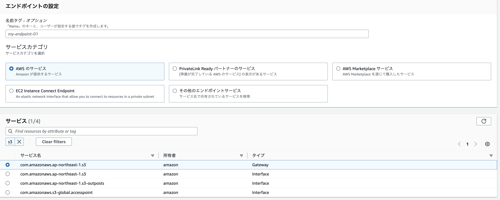

### インターフェース型(PrivateLink型)
50種類以上のサービスが対応しており、S3はインターフェース型の接続も可能。  
データの転送とサービス利用時間に応じて課金する必要がある。  
AWSのインターフェースエンドポイントは、VPC内の特定のサブネットにElastic Network Interface (ENI) を提供することで、プライベートな接続を介してAWSサービスにアクセスするためのエンドポイントを作成します。このENIはVPC内のプライベートIPアドレスを持ち、このENIを経由してAWSサービスに接続します。

要するに、VPC内にプライベートIPアドレスを持つエンドポイントインターフェース（ENI）が提供され、このENIを通じてAWSのリソースにアクセスするのは、インターフェース型のVPCエンドポイントの特徴です。

VPCエンドポイントを利用して、プライベート接続を介したサービスを提供する技術をAWS PrivateLinkと呼ぶ。

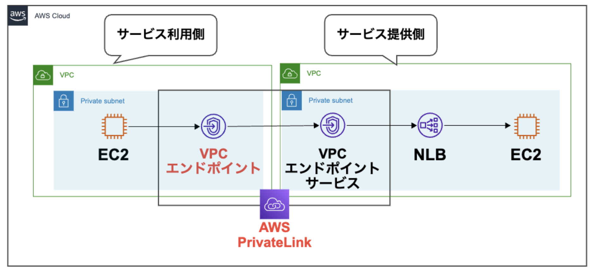
[【初心者向け】VPCエンドポイントとAWS PrivateLinkの違いを実際に構築して理解してみた](https://dev.classmethod.jp/articles/aws-vpcendpoint-privatelink-beginner/)

作成としては以下の手順を踏む
1. VPCサービスのエンドポイント機能を選択
2. com.amazonaws.ap-northeast-1.s3のInterfaceを選択
3. 設定するVPCを選択
4. 設定する`サブネット`を選択
5. 適用する`セキュリティグループ`を選択
6. バケットポリシー側で設定したVPC-Endpointからのアクセスを許可する

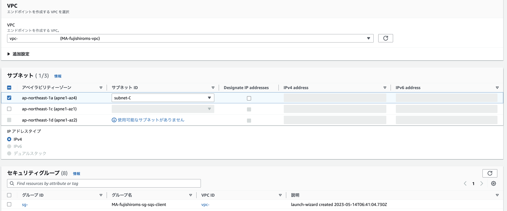

#### サードパーティサービスの提供
自作のサービス（サードパーティサービス）を他のVPCやオンプレに対してプライベートに利用してほしい場合はNLBを経由して、インターフェース型のVPCエンドポイントを払い出すことができる。

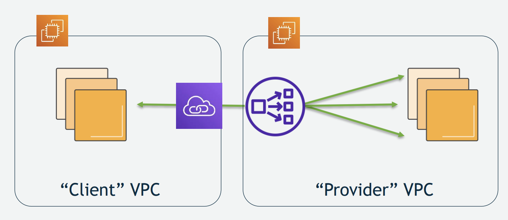

### ゲートウェイ型とインターフェース型の違い
ゲートウェイ型のEndpointのIPは、内部IPではなく外部IPであるという点が特徴的である。
すなわちAWS内部からAWS内部への通信であるものの、VPC内→エンドポイントへの通信は外部のIPへのアクセスに見える。  
一方で、インターフェース型はENIがVPCの内部にサービスが立ち上がっているように見えるので、VPC内部→VPC内部の通信で完結する。  
この辺りは[2つのVPCエンドポイントの違いを知る](https://dev.classmethod.jp/articles/vpc-endpoint-gateway-type/)が参考になる。

さらに、VPC外からの接続について差分がある。  
GW型では通信を設定し合ったVPCのみで通信が可能であり、そのVPCと接続している他の環境（オンプレや別のVPC）から Endpointを経由することはできない。  
一方で、インターフェース型は、VPC外からもVPC自体への接続を確保してしまえば、 Endpointを経由して対象サービスにアクセスすることができる。

## 外部からVPCへの接続
AWS外部からVPCへの接続を行う方法について、大きく3パターン
- AWS クライアントVPN: クライアントとの接続設定
- AWS Site-to-Site VPN: データセンタやオフィスとの接続設定
- Direct Connect: 物理線を引いての接続設定

### AWS クライアントVPN
VPCの外部のクライアントから、VPCに接続する技術。
データセンターなどではなく、単独のクライアントなどと接続する際に利用する。

#### 設定方法
1. クライアントが利用するCIDRを設定
2. 認証タイプを設定

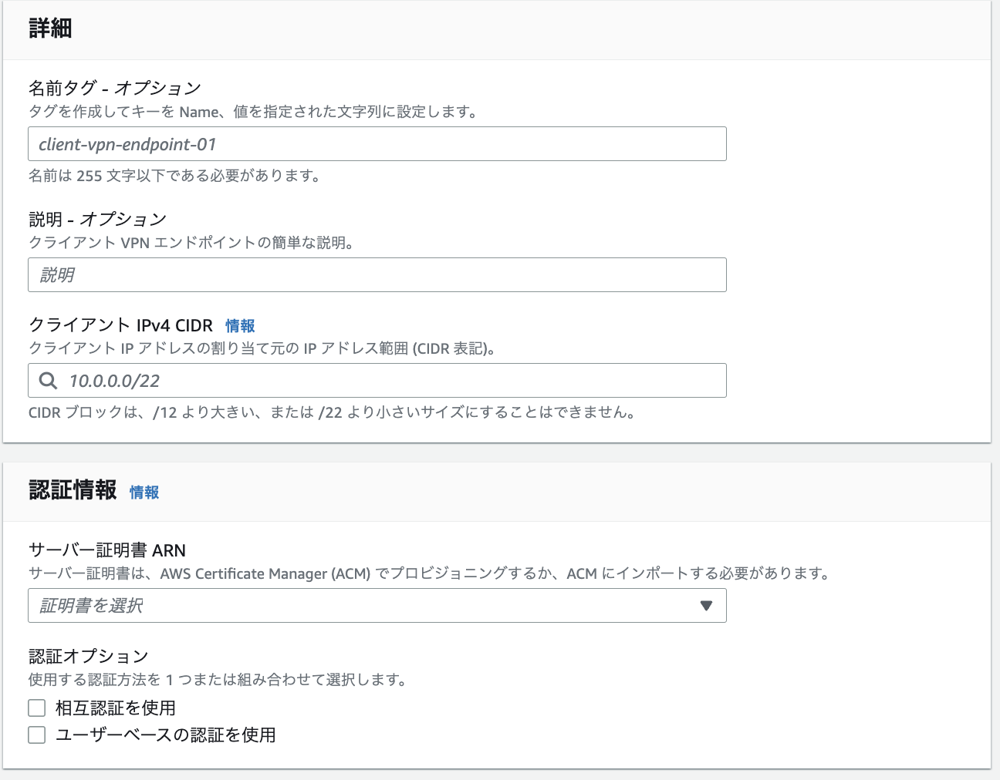

3. サブネットにVPNを関連づける  
    VPNのENIが発行される  
    VPNを経由して、別のAWSリソースにアクセスする際はこのENIのIPが利用される
4. 認証設定  
    デフォルトでは、VPNない全てのリソースにアクセス権限を持っていないので、明示的にアクセス先を許可する

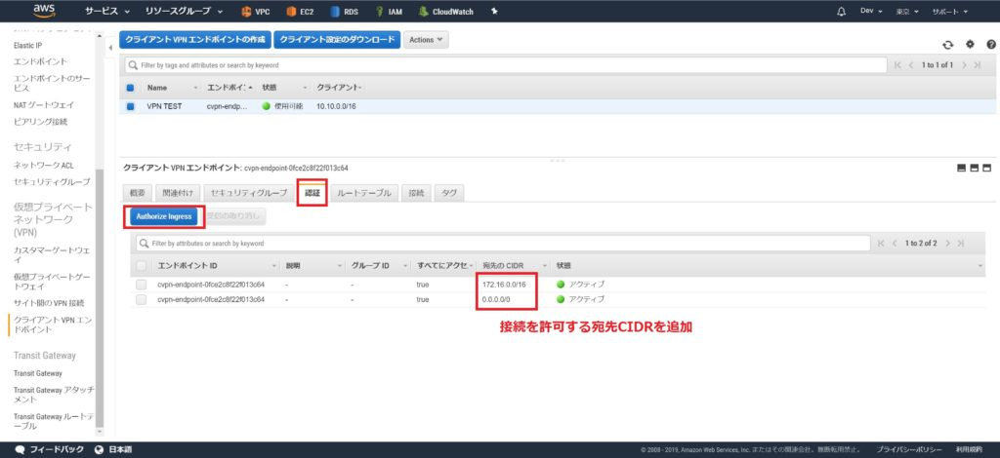

5. クライアント用のVPN Endpoint設定をDLする  
    作成されたエンドポイント情報をDLして、クライアント側でVPNの設定を行う

#### 認証タイプ
AWSクライアントがVPNに接続する際の認証は以下の3パターンが準備されている
- Active Directory認証(ユーザーベース)
- シングルサインオン：SAMLベースのフェデレーション(ユーザーベース)
- 相互認証（証明書ベース）

### AWS Site-to-Site VPN
VPCに仮想プライベートゲートウェイをアタッチして、データセンターなどのオンプレのルーターと、IPsec VPN接続を可能にする。
自動的に2つの接続が設定され、高可用性が担保される。
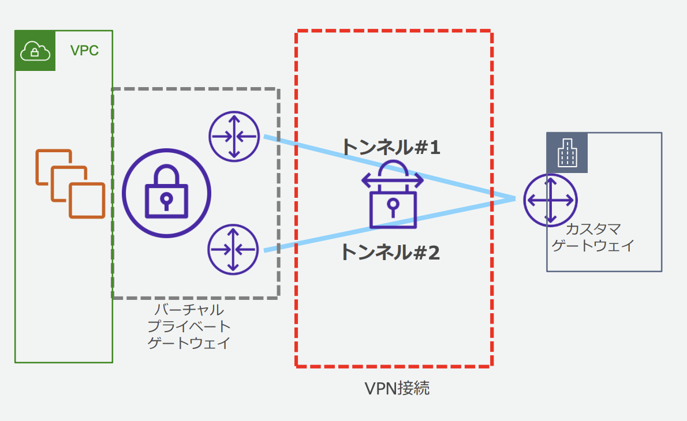

#### Cloud Hub設計
複数のオンプレミスが1つのVPCに接続するような設計をCloudHub設計と呼ぶ

#### 仮想プライベートGW
VPCエンドポイント側に設定するGW
##### 設定方法
1. VPCの画面から仮想プライベートGWを選択
2. 名前とASNの設定
3. 対象のVPCにアタッチ
4. ルートテーブルに対して、仮想プライベートGWへのルーティングを設定
#### カスタマーGW
カスタマーのルーター側で設定するGW
##### 設定方法
1. VPCの画面からカスタマーGWを選択
2. 名前、ルーティングタイプ、ASN、ルーターのIPを設定
#### VPN接続の確立
##### 設定方法
1. VPCの画面からSite-to-site VPN接続を選択
2. 仮想プライベートGWとカスタマーGWを選択
3. ルーター側に導入するconfigファイルをDLして、ルーターに導入する
#### 接続時の機能
- Internet Key Exchange  
    暗号化のために共通鍵を交換することができる
- デッドピア検出  
    接続先のデバイスが有効か否かを確認できる
- NATトラバーサル  
    オンプレ側でNATルーターを介したVPNが可能

### Direct Connect
ユーザーのルーター（Customer Router）からDirect Connectのルータ（DX Router）に光ファイバーケーブルを介して接続するサービス。インターネットを経由しない専用線を確保できる。  
通信速度に関しても最大100GBpsを確保することができるので、金額と設定の手間がかかる分、安全性と通信速度を確保できる。

下図のようにAWSのDirectConnectロケーションを経由してオンプレミス環境やDBとAWS内の通信を確立する。

[公式ドキュメント](https://docs.aws.amazon.com/ja_jp/directconnect/latest/UserGuide/Welcome.html)

接続方法などは[参考サイト](https://atbex.attokyo.co.jp/blog/detail/85/)参照。

#### 接続方法
専用接続とホスト接続がある
##### 専用接続
単一アカウントに専用の物理線を引きます。主要なデータセンターなどを経由して線を引くことになる。
1G以上の(1Gbps/10Gbps/100Gbps)帯域幅を確約できる。
##### ホスト接続
AWS Direct Partner(NTT東日本など）を利用して提供されるため、複数のお客さんと共有をする。
そのため、帯域幅もMbps(50Mbps-500Mbps)という比較的小さいサイズで契約することができる。

#### 冗長性
##### VPNバックアップ
AWS Direct ConnectとVPNを併用して、VPNをバックアップにすることができる。
VPNは1.25Gbpsまでをサポートしているので1Gを超える場合は、別のバックアップを検討する必要がある。
##### 高い回復性
Direct Connect Location自体は冗長構成をとるが、Direct Connect Locationの内部は冗長構成にしない。
つまり、ロケーションに障害が発生すると、別のロケーション経由の通信を行うが、障害が発生したロケーション自体は利用できない。
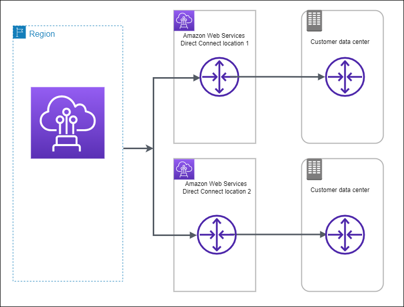

##### 最大回復性
高い回復性に加えて、ロケーション内の冗長構成もとる
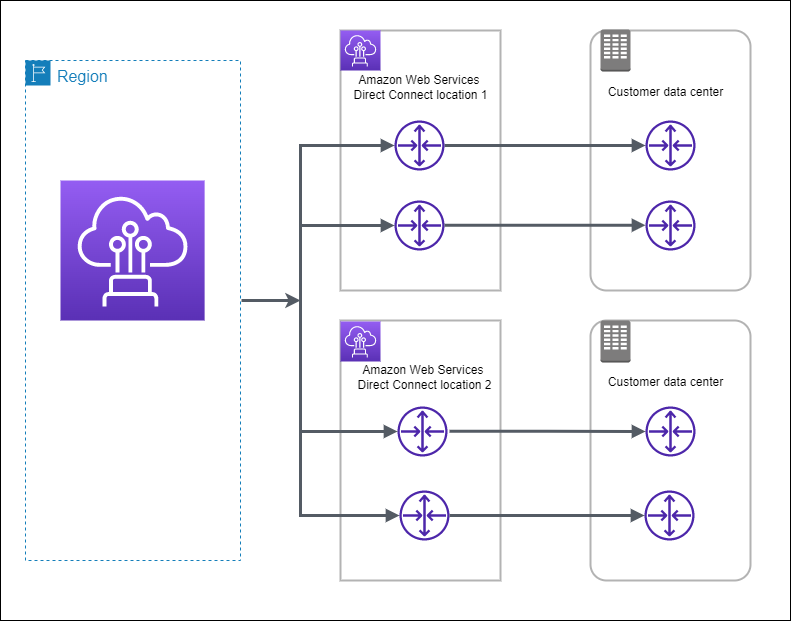
#### 仮想インターフェース
Direct Connectでは、仮想インターフェース（VIF)を利用して通信を行う
##### プライベート仮想インターフェース（プライベートVIF）
DirectConnectを経由してVPCに接続する際に利用される。
##### パブリック仮想インターフェース（パブリックVIF）
DirectConnectを経由してパブリックなAWSサービス（S3やDynamoDB）に対して接続することができる。
##### トランジット仮想インターフェース（トランジットVIF）
DirectConnectを経由してTransitGWに対してアクセスすることができる。

## VPC同士の接続
VPCが他のVPCと接続するための設定。  
一対一の場合は、VPCピア接続が容易。一対多の場合はTransit GWを利用すると管理が容易になる。

### VPCピア接続
異なるリージョンであっても、設置を行うことでVPC-AとVPC-Bで通信を可能にする。
ただし、VPC-AとVPC-BがVPCピア接続していても、VPC-Bとピア接続しているVPC-CからVPC-Aへの接続はできない。

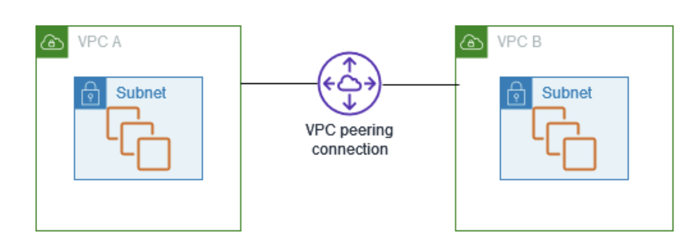

#### 設定方法
[参考サイト](https://zenn.dev/rescuenow/articles/8e21a751c828c6)がわかりやすいので確認すると良い。

1. リクエスタ(接続元)側でピア接続設定を行う
    - 接続元のVPC ID
    - 接続先のアカウント情報（同じアカウントか否か）
    - 接続先のリージョン（同一リージョンか否か）
    - 接続先のVPC ID
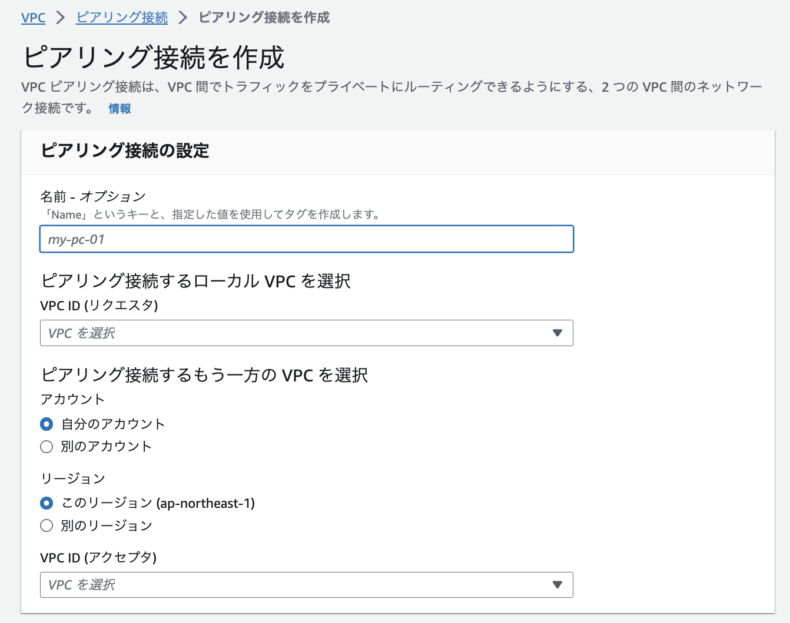
2. アクセプタ(接続先)側で承認する
    - ピア接続設定を確認すると承認待ちになっているので承認をする
3. リクエスタとアクセプタ両方でルートテーブルの設定を行う
    - CIDRの設定を行う
    - ターゲットにピアリング接続を行う
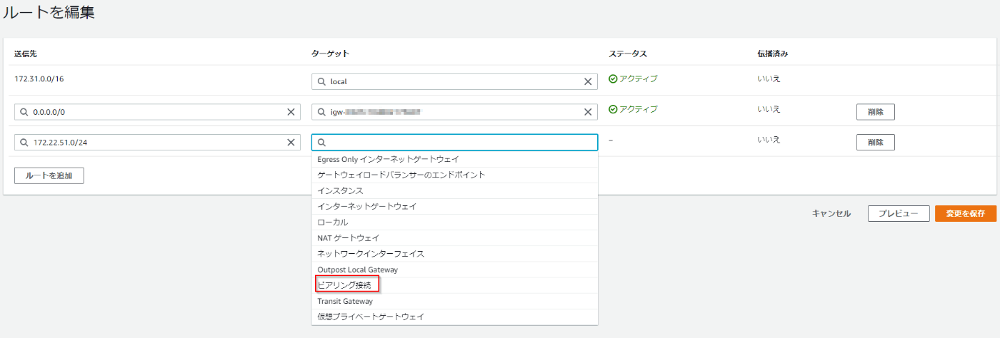

### Transit Gateway
最大で5000のVPC同士の接続やVPCとオンプレとの接続を管理することができる。
Site-to-Site VPN接続やVPCピア接続について個別設定せずに、Transit GWで集中管理できる。

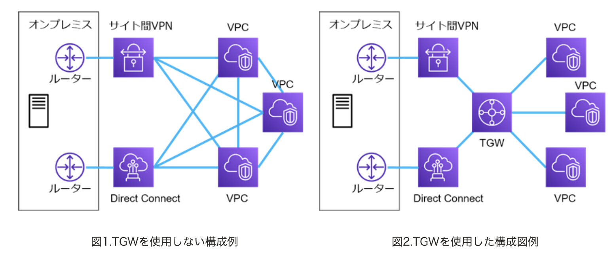

#### Transit GW同士を接続する
Transit GW同士のピア接続も可能であり、利用する場合は、Resource Access Managerを利用して、Transit GW接続のリクエストとアクセプトを行う。

#### VPCピア接続の取りまとめ
VPCピア接続を利用して複数のVPC同士を接続すると以下のような課題がある
- トランジットトラフィックに対応できない
    - VPCを跨いだ通信はできない
    - すなわち、すべてのVPC同士の設定が必要
- VPCを追加すると、全てに修正が入る

Transit GWを利用することで、トランジットトラフィックに対応でき、追加時もTransitGWを修正するだけで良い

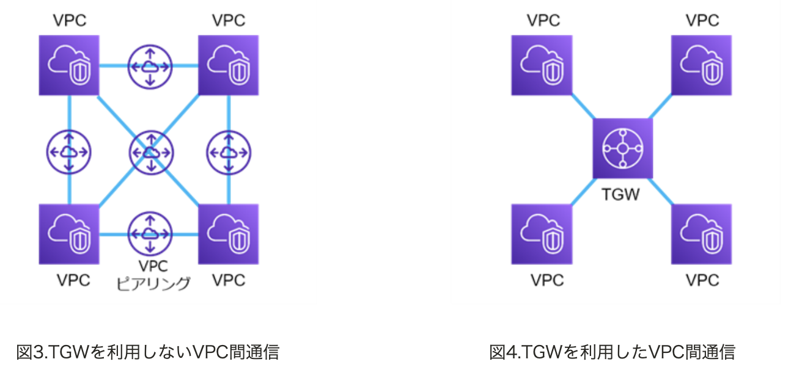

#### VPN接続の取りまとめ
VPN接続を利用して複数のVPCに接続しようとすると、それぞれのVPCに対してVPNの設定が必要。
しかし、TransitGWを利用すれば、オンプレとTransit GWまでの設定をするだけで、後ろのVPCの追加が容易になる。
DirectConnect GWを利用することで専用線経由のVPNにも対応できる

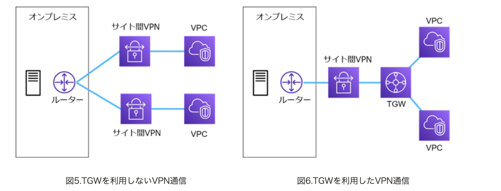

#### TransitGWの補足
TransitGWを利用する際に、Global Acceleratorを有効化すると、Acceleratedサイト間VPNが利用でき、エッジロケーションのGlobal Acceleratorを利用して、ネットワークの安定性が向上する。

Transit GW Network Managerを利用すると、ネットワークの可視化とモニタリングが可能。

### VPCとの接続まとめ
#### クライアントVPN
個別のクライアントからAWSに接続したい場合
- クライアント：クライアントSW
- AWS：クライアントVPNエンドポイント
#### Site2Site VPN
オンプレからVPCにアクセスしたい
- オンプレ：カスタマーゲートウェイ
- AWSのVPC：仮想プライベートGW
#### DirectConnect(DX)
オンプレから専用線を利用してVPCにアクセスしたい
- オンプレ：ルーターからDX Routerを目指す
- AWS: 仮想インターフェース
    - プライベートIF：仮想プライベートGW or DX GW
    - パブリックIF：S3やDynamoDB
    - TransitIG：DXGW経由でTransitGWにアクセス
#### DX GW
オンプレから専用線を利用して、複数のVPCにアクセス（10以下）
- オンプレ：ルーターからDX Routerを目指す
- DXGW：DXRouterから仮想プライベートIFとしてDXGWを接続して、DXGWから仮想プライベートGWへ
- AWS：仮想プライベートGW
#### VPCピアリング
VPC同士の接続。接続元から接続先にリクエストをして承認する。遷移的なアクセスは不可
#### TransitGW
VPCピアリングで管理できないようなVPC数を接続可能。遷移的なアクセスも可能  
その状態で、仮想プライベートGWのように振る舞うことができ、カスタマーGWやDXGWと接続可能（DXRouterとは接続しない）
- VPC同士を紐づける
- 多数VPCとVPNでオンプレと接続する
    - オンプレ：カスタマーGW
    - AWS：TransitGW
- 多数VPCとDXでオンプレと接続する
    - オンプレ：DX Router
    - DXGW
    - AWS：TransitGW
#### TransiGWピアリング
TransiGW同士を接続することで別リージョンにも対応

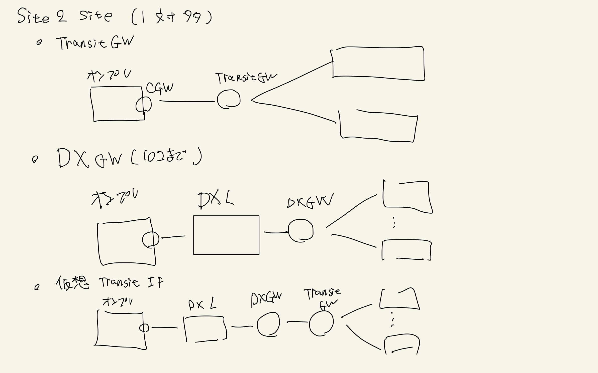
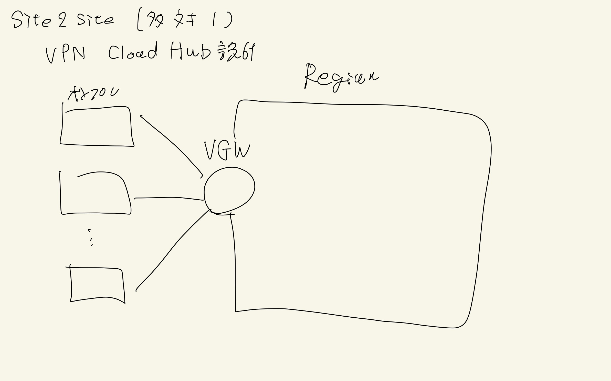

## Route53
### HosteZone
パブリックホストゾーンとプライベートホストゾーンがある。
- パブリック：インターネット上に公開されたDNSドメインを管理
- プライベート：VPC内のドメインのレコードを管理

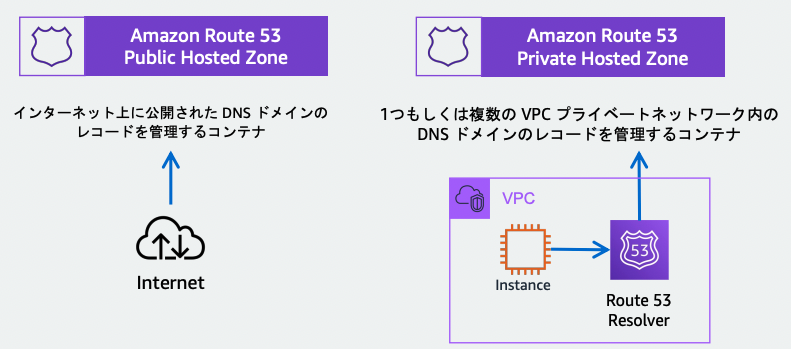

### Resolver
VPC内やオンプレからの問い合わせを解決するサービスで[こちらの記事](https://dev.classmethod.jp/articles/explain-route53-resolver-ram/)がわかりやすい

#### VPC内の名前解決
通信を行う際に、Resolverに問い合わせを行い、Resolverはhosted zoneに問い合わせを行い解決する。

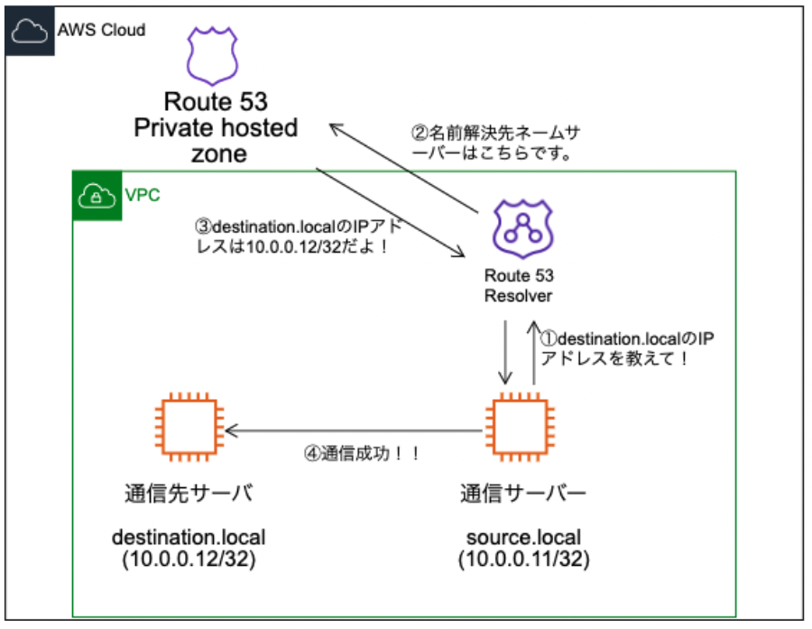

#### オンプレからの名前解決(インバウンドエンドポイント)
オンプレミス環境からクラウド環境に名前解決のリクエストをする際には、Route53 Resolverのインバウンドエンドポイントの設定が必要になる。インバウンドのエンドポイントが作成されると、IPが発行されるので、このIPをオンプレ側のDNSに設定する。

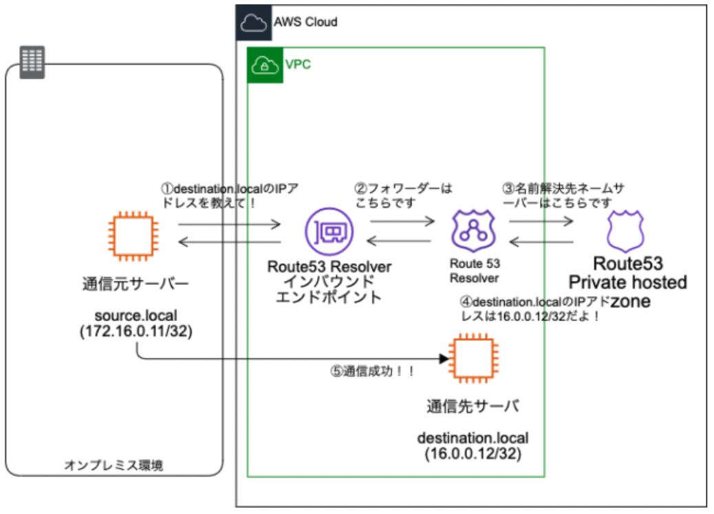

#### オンプレへの名前解決（アウトバウンドエンドポイント）
クラウド側からオンプレミスのDNSで名前解決をリクエストする際には、Route53 アウトバウンドエンドポイントとRoute53 ResolverRuleを設定する必要がある。

このResolver Ruleは共有が可能で、別のAWSアカウントなどで共通利用することができる。

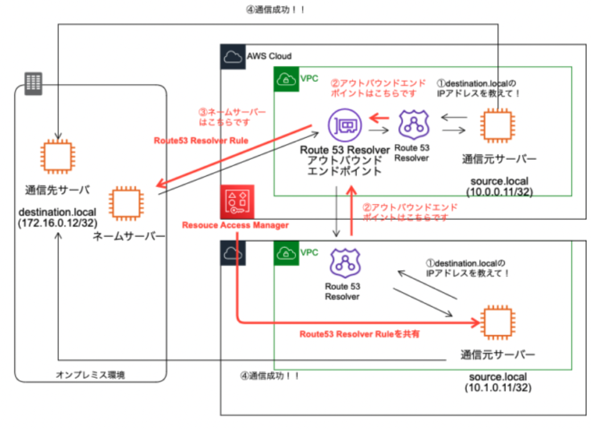

#### VPC間での名前解決
VPC内部でのDNSサーバーを有効化するために、enableDnsSupportをTrueにする必要がある。VPC内のインスタンスたちにホストネームを割り当てるためにenableDnsHostnamesが割り当てられる。

上記の設定をした上でRoute53にプライベートエンドポイントの設定をしてお互いのVPCにルートの設定をする。
具体的には、CreateVPCAssociationAuthorizationを利用して、他のホストゾーンに対する名前解決の許可をする。次にAssociateVPCWithHostedZoneでホストゾーンにVPCを関連付ける。

### レコード
- Aレコード：IP Addressとドメイン名の紐付けを定義
- CNAME: １つのドメイン名と他のドメイン名の紐付けを定義
- Alies: Route53特別なレコードドメイン名とAWSリソースの紐付けを定義（AWSリソースのIPが変更してもマネージド対応してくれる

### ルーティング
Route53では複数のルーティング方法がある。

- レイテンシーベース:レイテンシーが小さくなるようなルーティング
- フェイルオーバー：ヘルスチェックを行なってNGになるとセカンダリにルーティング
- 荷重ルーティング：事前に設定した荷重に従ってルーティングを行う。

上記のルーティングベースポリシーは組み合わせが可能であり、レイテンシーベースで割り振りつつ、荷重ルーティングで分散することも可能。加えてフェイルオーバーをすることも可能。

Evaluate Target Healthという機能があり、接続先のELBのヘルスチェックを行って、エラーになった場合に、別の候補にルーティングすることができる。これは、フェイルオーバールーティングでもレイテンシーベースルーティングでも利用可能。
レイテンシーベースとEvaluate Target Healthを組み合わせれば、フェイルオーバールーティングのような挙動も可能。

## IPv6対応
IPv4に対応しているVPCにしてIPv6を追加することでハイブリッドなデュアルスタックモードにすることができる。

### 初期設定
IPv6のCICDを作成して、VPCとサブネットに紐付ける。  
VPCに紐づける形で、Egress-only IGWを作成する。

### パブリックサブネットの設定
サブネットからIGWへのトラフィックをIPv6についても設定する。IGWはIPv4とIPv6両方に対応している。

### プライベートサブネットの設定
サブネットからEgress-onlyへのトラフィックをエントリーする。

### セキュリティグループの設定
IPv6のルールをネットワークACLやセキュリティグループに追加する