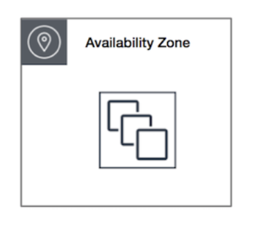
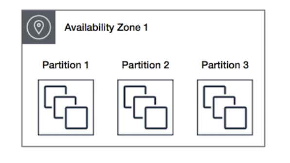
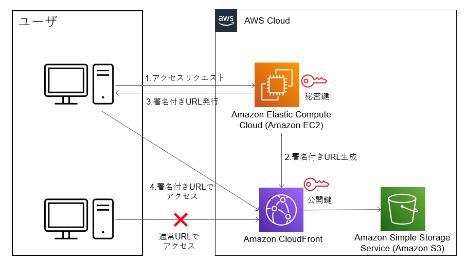

# パフォーマンス
## EC2のパフォーマンス
### インスタンスタイプ
インスタンスタイプは4つのセクションに分類できる
> ファミリー/世代/追加機能.サイズ

例えばm6g.largeは、
- m・・・・ファミリー
- 6・・・・世代
- g・・・・追加機能
- large・・サイズ

と分割できる。
#### インスタンスファミリー
代表的なインスタンスファミリーについては理解しておく

| 用途 | ユースケース | インスタンスファミリー |
|----------|----------|----------|
|汎用　　　　　　　　　　  | 一般アプリ  |  T系・M系・A系 |
|コンピューティング最適化  | 機械学習推論  | C系  |
|メモリ最適化  　　　　　　| 大規模データセット処理  | R系・X系  |
|高速コンピューティング   | 機械学習推論  | P系・G系・F系・Tm系  |
|ストレージ最適化　　　   | ビックデータ処理  | I系・D系・H系  |

#### 追加機能
追加機能
- d：一時的なストレージであるインスタンスストア（エフェメラルストレージ）を使用可能
- n：ネットワーク強化
- a：AMDプロセッサ搭載
- g：Gravitonプロセッサ搭載

### バーストパフォーマンスインスタンス
T系のインスタンスにはCPUバーストパフォーマンス機能がある。

通常はインスタンスサイズごとに定められたCPUが使用され、ベースラインを超える場合にはCPUクレジットが消費されれる。
消費されたクレジットは、ベースラインに戻って時間経過すると回復する。

### ネットワークのパフォーマンス
EC2は基本的にはENA（Elastic Network Adaptor)がサポートされていて、高い帯域幅、パケットパフォーマンス、インスタンス間の低レイテンシーが提供されている。

単一パケットで渡すデータサイズについても、全てのEC2でイーサネットのデフォルトである1500MTUが確保されている。
さらに、ほとんどのインスタンスで9001MTU(ジャンボフレーム)がサポートされている。ただし、IGWやVPN接続で1500MTUに制限される。

### プレスメントグループ
インスタンスの配置戦略により、配置を分散させることで障害発生時の影響を抑えることができる。一方で配置を集中させることでネットワークレイテンシ−を低減することができる。

プレスメントグループには3パターンがある
#### クラスタプレイスメントグループ
全て同じAZの同じネットワークセグメントに配置される。  
ネットワークレイテンシーを低減させることができる

#### パーティションプレイスメントグループ
全て同じAZの中ではあるものの、ハードウェアは別にすることで障害を低減するパーティションという単位を作成する。
これは、そもそも分散処理を想定しているユースケースにおいて、性能向上を期待することができる。

#### スプレッドプレイスメントグループ
同じAZ内ではあるものの、独自のネットワークと電源がある異なるラックに配置される。
1つのAZ内に最大7つのスプレッドグループを配置することができる。

## ストレージのパフォーマンス
### Amazon FSx
#### Amazon FSx for Windows Server
SMBプロトコルをサポートしており、Windowsからのアクセスが非常に簡単。
一方でLusterのクライアントをインストールすることでAmazon FSx for Lustreも利用できる。
#### Amazon FSx for Lustre
高性能計算や大規模ワークロードで使用されている分散ファイルシステムがLustreである。
FSx for Lustreは効率に起動でき、S3との連携も統合されており、インポートとエクスポートがしやすいメリットがある。

### S3
#### マルチパートアップロード
大規模なデータについてはAWS側でアップロード時に分割してアップロードをしてくれる。

#### S3 Transfer Acceleration
グローバルなインターネットからアップロードする際に、レイテンシーが大きくなる可能性があるので、Transger Accelerationを有効化すると、エッジロケーションを経由したアップロードになるので性能が改善する。

#### RTC
S3 RTC(Replication Time Control)を利用すると、99.99%のオブジェクトが15分以内にコピーが完了する。
15分を超えてコピーされた場合や、コピーされたオブジェクトに関するCloudWatchによる監視が可能。

## DBのパフォーマンス
### RDS
インスタンスクラスがあり、考え方はEC2と同様である。  
ストレージは汎用SSD・プロビジョンどIOPSとマグネティックから選択できる。  
リードレプリカと呼ばれる、読み取り専用のDBとエンドポイントを発行することができる。

### Aurora
MySQSとPostgreSQLと互換性のある高パフォーマンスDBエンジンAuroraが利用できる。
AWSがクラウドの特性を利用した分散型のアーキテクチャを検討した形になっている。

### DynamoDB
パーティションキーはアクセスが分散するようにすることで性能が改善する。
日付などをパーティションキーにするとアクセス集中する可能性があるので、適当なサフィックスをつけるなど工夫をする。

### ElastiCache
マネージドなインメモリサービスであり、データの読み取り速度を高速化させることができる。
高頻度で利用されるクエリの結果や複雑な計算を要する計算処理結果の負荷を低減することができる
#### Memcached
男性を意味する(man)にスペルが近いという覚え方。  
男性ぽく、シンプルなものをマルチタスクで力強く扱うイメージ。  
単純なキーバリュー形式でのペアを保存することに特化しているため、シンプルかつ費用対効果が高いようなイメージ。

#### Redis
女性を意味する(lady)にスペルが近いという覚え方。  
女性らしく多様なデータの持ち方をすることができ、そのデータを永続に覚えられるそして暗号化できるなどの繊細さをもつ。  

単純なキーバリュー形式だけでなく、リスト・セット・ハッシュ・ビットマップなど高度なデータ構造をサポートしている。
さまざまなタイプのデータ構造を高速に操作したい需要に応えることができ、例えばソートセットという順番付きのデータをメモリー上に保存することができるので、ゲームのリーダーボードなどのユースケース例が有名。
アトミックオペレーションで、データへのアクセス回数を記録できる。

#### キャッシュの戦略
ライトスルー戦略は、Appにデータを書き込む際にキャッシュも同時に更新する戦略であり、キャッシュミスが発生しにくくなるメリットがある。一方で、アクセス頻度の低い情報までキャッシュされてしまう問題や書き込み時に遅延が発生する問題がある。

遅延書き込み戦略は、必要なデータだけキャッシュに書き込む戦略である。必要なデータだけがキャッシュに書き込まれるのでキャッシュの利用効率が高い。ただし、読み込み時にキャッシュミスが発生しやすいので、レイテンシーが増加する可能性がある。

## Appのパフォーマンス
### CloudFront
コンテンツ配信サービスで、キャッシュ機能によりオリジンへの負荷を低減することもできる。

配信設定をディストリビューション、パスパターンに応じたルーティングのルールのことをビヘイビアとして指定することができる。
#### オリジンへのアクセス制限
オリジンへの負荷を低減するためにCloudFrontを利用するため、オリジンへの直接アクセスは制御する必要がある。
##### OAC(Origin Access Control)
S3がオリジンの場合に設定することができる。

CloudFront側でOICを作成し、S3側のバケットポリシーでOICからのアクセスを許可する。
バケットポリシーだけの制限も可能であるものの、シンプルかつ一貫性のあるルール設定ができるため推奨とのこと。

##### カスタムヘッダー
ALBがオリジンの場合に利用すると有効。  
ディストリビューションのオリジン設定に任意のキーと値をカスタムヘッダーに追加する。
リクエストヘッダーにこの値があることを確認しあって通信を許可する。
##### IP制限
オリジン側のセキュリティグループにおいてCloudFrontからのアクセスを許可する方法。  
ただし、マネージドプレフィックスリストを使用する形になり、SGの制限すう60のうち55を利用してしまう。

##### 署名付きURL
上記の3つとは異なり、ログイン後のユーザーだけが特定のリソースにアクセスできるようにするようなユースケースで利用する。
例えばS3へのアクセスをログインユーザーに絞る場合は、CloufFrontのビヘイビアの設定で署名付きURLだけの許可に絞り、インスタンスでログイン処理をした後に、署名付きURLを発行する。

手順としては以下
- ローカルで秘密鍵と公開鍵を作成
- CloudFront側で公開鍵をアップロード
- CloudFrontでキーグループを作成
- ディストリビューションで以下を設定
    - オリジンへのアクセス制御
    - キーグループのでの制御
- 認証後のポータルサイトなどで秘密鍵を利用して署名URL発行

[参考記事](https://www.aws-room.com/entry/presigned-cloudfront)がわかりやすい

#### 暗号化
CloudFront側に公開鍵を設定しておくことで、フィールド上のデータを暗号化することができる。
秘密鍵は SecretsManagerに登録しておき、Lambdaなどで複合してアクションを起こすことで秘密情報を人目に触れることなく処理させることができる。

#### エッジ関数
軽い処理の`CloudFront Functions`とLambdaの拡張である`Lambda@Edge`がある。

### Global Accelerator
ユーザーからのリクエストに対して、最適なAWSエンドポイントを返すことができるサービス。
統一的なIP（エニーキャストIP）を利用して、適切なエンドポイントへのアクセスを提供するため、ユーザーはいつでも同じIPにアクセスすることができるようになる。

また、TTLの設定がないため、フェイルオーバーの際には変更後即時に新規のポイントへルーティングがされるメリットがある。

### API GW
#### キャッシュ
API GWのAPIステージの中でキャッシュを有効化することができる。  
GETに対しては速度の改善とオリジンへのリクエストの低減という効果がある。
指定したキャッシュインスタンスが作成されることになる。費用はキャッシュした容量と時間に応じた費用になる。

#### 使用量プラン
APIキーごとに1sec/1day/1week/1monthの単位でAPI利用料を設定することができる。
ユーザーに提供するAPIキーに値を設定することで異常な数のリクエストに制限をかけることができる。

#### 認証
API GWで認証制限をするためには3つの方法がある
##### IAM
クライアント側は実行許可ポリシーを作成し、ユーザーに付与する。
そのユーザーのアクセスキーやシークレット情報を利用して署名を作成し、この署名をリクエストに含める。

クロスアカウントの場合は、API GWでリソースベース許可として、クライアント側のユーザーを指定して許可してあげる。

##### Cognito
Cognito認証で取得したJWTをヘッダーに含めて実行することでAPIの実行権を発行することができる。

##### Lambda
カスタムで認証したり、サードパーティの認証を検証する
