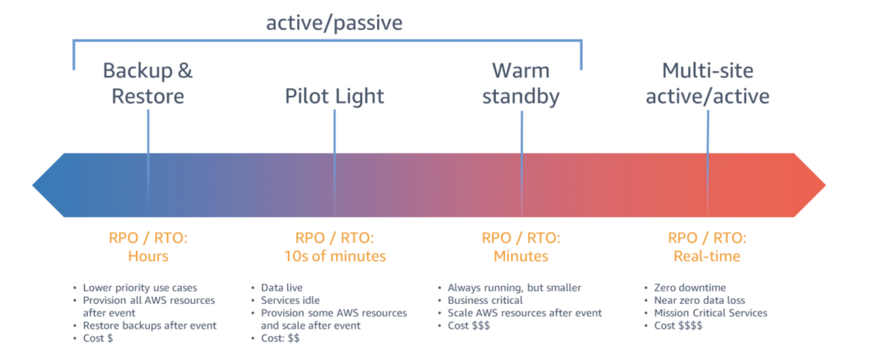
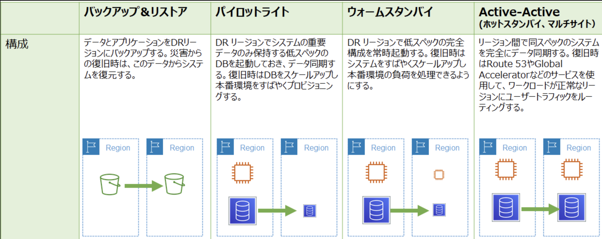
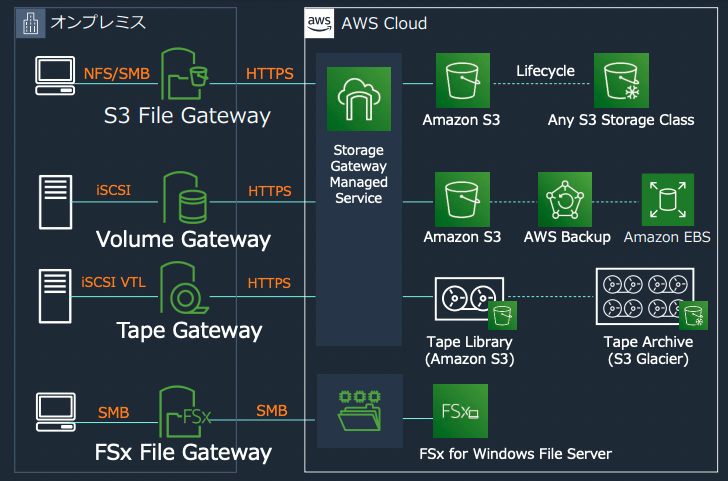
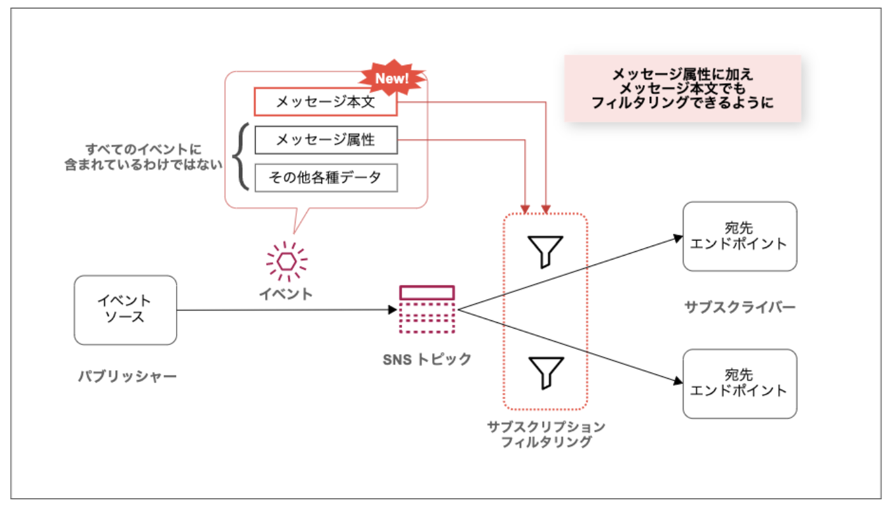

# 信頼性
## 災害対策
重要なAppでどんな時でも事業を継続できるようにしておく必要がある。  
災害などシステムに影響する障害に備えるのが災害対策（DR）

### RPO
Recovery Point Objective  
障害発生によりオンラインのデータが失われた際に、バックアップから復旧したデータがいつまでの時点まで戻るかのポイント。

### RTO
Recovery Time Objective  
障害発生から、システムが完全復旧するまでに要する時間。

### DRと対策
DRに対して4つのシナリオがあり、RPOとRTOを保証するほどコストが高くなっていく
- バックアップ&リストア
- パイロットライト
- ウォームスタンバイ
- マルチサイト アクティブ/アクティブ

[AWSの公式](https://aws.amazon.com/jp/blogs/news/disaster-recovery-dr-architecture-on-aws-part-1-strategies-for-recovery-in-the-cloud/)

[Qiiitaの記事](https://qiita.com/emiki/items/6039bc7e608a1b1afc8a)

### バックアップ&リカバリー
完全に火を消しておいて、同じ環境を作れる道具だけ準備しておくイメージ。  
定期的にバックアップを作成しておいて、障害時にバックアップから復旧を行う。

#### オンプレからAWSへのリカバリー
オンプレで稼働しているシステムのバックアップをAWSにしておいて、障害時にはAWS内でリカバリーをするという構成。

DBに関しては、S3バケットに保存し、保存期間や取り出すスピードに応じてストレージクラスを選定する。
WebAppに関しては、AMIを作成しておいて、CloudFormationを利用して起動させる。

##### Storage Gateway
オンプレミスのデータとAWSのデータを統合するクラウドストレージサービス。
これにより、オンプレミスのAppからシームレスにAWS上のストレージを利用することができる。

3つの利用形態と、4つのゲートウェイがある
- ファイルゲートウェイ
    - S3ファイルゲートウェイ  
        S3に直接ファイルを保存するオンプレのファイルベースアプリでS3のオブジェクトストレージを利用する。
    - FSxファイルゲートウェイ  
        オンプレからFSx for Windows File Serverへのアクセスを可能にする。
- ボリュームゲートウェイ  
    iSCSIブロックプロトコルを利用してブロックストレージS3にファイルを保存し、ブロックストレージへのアクセスを提供する。
    - キャッシュ型モード  
        オンプレ側は頻繁にアクセスされるデータをキャッシュとして所持しておき、実態はAWSに非同期に保存する。
    - 保管型モード  
        オンプレのに全てのデータが保存され、非同期にS3にバックアップが保存される。
- テープゲートウェイ  
    既存のオンプレのバックアップアプリと東堂して、仮想テープライブラリとして動作する

[BlackBelt](https://pages.awscloud.com/rs/112-TZM-766/images/AWS-Black-Belt_2023_AWS-Storage-Gateway_0131_v1.pdf)

#### AWSのマルチリージョンのリカバリー
AWSで稼働しているシステムのバックアップを別リージョンにしておいて、障害時には別リージョンでリカバリーをするという構成。

注意点として、EC2のAMIやRDSのスナップショットは復元先のリージョンへ定期的にクロスリージョンコピーする必要がある。

##### AWS Backup
AWSのストレージ、DBサービスのバックアップを一元管理して自動化できるサービス。
これまでもバックアップできたが、AWS Backupを利用すると主要サービスを一元管理、設定することができる。
対象は以下など
- EC2
- EBS
- RDS
- DynamoDB
- EFS

ポイントは、バックアップ管理単位を意味するバックアップボールドやバックアップに関するルールを定めるバックアッププラン。
全体像や設定イメージについては、[classmethodの記事](https://dev.classmethod.jp/articles/aws-backup-perfect-understand/)がおすすめ。

### パイロットライト
パイロットライトは種火という意味。本当に最低限の環境を別に準備しておく。必要になったら火を大きくするイメージ。  
DBは別リージョンに低いスペックのものを作成しておいてデータの同期を行う。
アプリケーションは、停止しておいて、障害時に起動しDR用のDBを利用する。

App側はAMIとCFNを作成しておき、災害時に実行することで起動するのはバックアップ&リカバリーと同じ。
RRDSやS3、DynamoDBはクロスリージョンレプリケーションをしておくことで、リアルタイムに近いコピーをしておく。

### ウォームスタンバイ
完全に同じ環境を低いスペックで準備しておく。必要になったら火を大きくするイメージ。  
DBとApp両方とも低いスペックのものを別リージョンに起動させておいて、障害時にDNSを切り替えて稼働させる。

Appについても最小構成でスタンバイしておく。AutoScalingの設定などを行なっておくことで、DR後も本番のトラフィックに対応できるようにしておく。

### マルチサイト アクティブ/アクティブ
完全に同じ環境をどうスペックで準備しておく。最初から同じ大きさの火をつけておくイメージ。  
DBとApp両方とも本番と同じスペックのものを別リージョンに起動させておいて、障害時にDNSを切り替えて稼働させる。
#### Global Accelerator
Route53を利用して、障害発生時にルーティングの切り替えを行うことができるが、キャッシュにより一部のユーザーを古い障害が発生している方へルーティングしてしまう可能性がある。GlobalAcceleratorは即時に宛先を更新するので、キャッシュの問題が発生しないため、これらを組み合わせて利用しているとキャッシュの影響を受けないで済む。

Global Acceleratorは、元々はDRのフェイルオーバーではなく、マルチリージョン構成でレイテンシーを低減するために利用される。
### AWS Fault Injectionn Simulator
DRの対策が設定通り動くかのテストに利用できるサービス。  
用意されたシナリオをAWSのリソースに注入することで災害をシミュレートすることができる。

## Route53
AWSのDNSサービスであり、パブリック（ウェブ上）やプライベート（VPC内）のリゾルバーを提供する。
ヘルスチェックをRoute53で行うことができる。
### ルーティングポリシー
#### フェイルオーバールーティング
プライマリに対して、障害が発生した場合にセカンダリとして設定している宛先へルーティングにフェイルオーバーしてくれる。
#### 位置情報ルーティング
接続元に対する、ルーティング先を設定することができる。
接続元の位置情報は事前に準備されている大陸、国、州などから選択する。設定したルールに合わない場合はデフォルトで設定した宛先にルーティングされる。
#### レイテンシールーティング
複数のレコードの中から一番低いレイテンシーのレコードを返す。

## DBの信頼性向上
RDSに対して大量の接続が発生する場合に、Too many connectionsというメッセージが発行され、接続拒否が発生する。
これは、機会損失やデータの喪失につながるため、対策を打つ必要がある。

### RDS Proxy
RDS Proxyを利用することで、DBへの接続のスケーラビリティと可用性を確保してくれる。アプリケーションにおけるキューのような役割を担っているといえる。
具体的には。DB接続プールを確立して効率的な接続を提供するとともに、仮に接続できない場合もProxyによって自動調整してくれる。

RDS ProxyはAurora、RDS(MySQS/Postgres)に対応している。

## Appの信頼性向上
App側についても、処理が集中することによるボトルネックやデータ損失を避けるために、SQSを利用したキューイングやAutoScalingによる並列処理を行う必要性がある。
### AutoScaling
EC2やECSのコンテナを自動で増減し、ELBからのリクエストを分散させることで負荷分散する。
#### スケーリングポリシー
##### スケジュールベース
特定の時間帯に対して、希望するインスタンス数や最大数最小数を変更することができる。  
最大数、最小数の設定を変更できるのはスケジュールベースポリシーのみ。

##### シンプルスケーリング
CloudWatchアラームの値をトリガーとして追加削除を行う。  
次に説明するステップポリシーの方が新しく、基本的にはステップポリシーを適用する。
クールダウンと呼ばれる時間を設定することができ、オートスケールが行われてから、次のオートスケールが行われるまでの間隔を指定することができる。
##### ステップスケーリング
CloudWatchアラームの値をトリガーとして段階的なスケールアウトとスケールインを設定することができる。
ウォームアップと呼ばれる時間を設定することができ、起動したインスタンスが十分な機能を発揮できるまでの時間を指定し、それまでは追加のオートスケールは行われない。
##### ターゲット追跡
利用するCloudWatchのメトリクスを指定し、そのメトリクスに対するターゲット値を設定することでオートスケールが行われる。
スケールアウトは短い時間で行われ、スケールインは時間をかけて行われる。
##### 予測スケーリング
過去のメトリクス情報を利用して、機械学習により必要な台数を事前に起動しておく。

### SQS
SQSを利用することで疎結合なアプリ構成とすることができる。
#### SQSを利用したオートスケーリングルール
SQSにはキューに溜まっているメッセージ数を示すメトリクスであるApproximateNumberOfMessagesVisibleを利用できるが、起動中のインスタンスを踏まえて起動数は定めるべきであるので、AutoScalingのInserviceのインスタンス数を取得し、1インスタンスで処理すべきキューの数をメトリクスとしてオートスケーリングルールを定めると良い。
#### 優先度を考慮したキュー
SNSからSQSへメッセージを発行するファンアウトの構成をとって、SNS側でサブスクリプションフィルターの機能を利用することで、SNSからPublishするメッセージを優先度高いものをキューAに優先度の低いものをキューBに発行することができる。

[classmethodの記事](https://dev.classmethod.jp/articles/amazon-sns-payload-based-message-filtering/)

## AWSの利用制限
AWSのリソースには利用制限が設定されているものがある。
利用制限について管理・通知するサービスについてService Quotasとクォータモニタがある

### Service Quotas
利用制限の中でも調整可能な制限があるものに対して現在のAWSでどうなっているかをモニターし、変更をリクエストすることができる。

### クォータモニタ
サービスの使用量が制限に近づいているモニタリングをすることができ、通知をさせることができる。