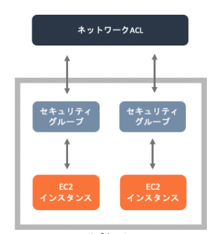

# セキュリティ

## ユーザー関連のセキュリティ
### ルートユーザー
ルートユーザーは全てのアクションが有効になっており、ルートユーザーでしかできないアクションも存在する。
基本的にルートユーザーは利用しない。
ルートユーザーに関しては利用する方が稀であるため、ルートユーザーの利用に関しては検知・通知するのが好ましい。  

例えば、GuardDutyの`Policy:IAMUser/RootCredentialUsage`というイベントを利用して、AWS API がルート認証情報を使用して呼び出されたことを検知できます。

また、CloudTrailのログをCloudWatchLogsに配信しメトリクスフィルターを利用して、Rootユーザーのログを検知することができる。

### 最小権限の適用
IAM Policyを作成したり付与する場合には必要以上のアクションやリソースを与えると余分なリスクが発生してしまう。

#### アクセス許可の境界
最小権限を守るためにアクセス許可の境界（Permissions boundarie)という機能がある。
これは、IAMユーザー、ロールに設定することができ、自分自身のポリシーを超えて新しいIAMの権限を作成することができないという機能。
すなわちS3にアクセス許可のないIAM RoleがS3にアクセス許可のあるポリシーなどを作成することができない機能。
OUに対するSCPの考え方に似ている。

#### IAM Access Analyzer
最小権限の原則を適用するために便利なサービスとしてIAM Access Analyzerがある。  
IAM Access Analyzerの機能は3つ
- 外部共有リソースの識別：意図しない外部共有を検知することができる
- IAMポリシーの検証：ポリシー作成時に4つの視点で検証してくれる
- CloudTrailに基づいたIAMポリシーの作成：対象期間を決めて、その間のアクセスなどをみて、ポリシーを作成してくれる

## VPC関連のセキュリティ
セキュリティグループとネットワークACLの違いを認識しておく

### セキュリティグループ
ENI(Elastic Network Interface)を保護するのがセキュリティグループ

ステートフルであるので、インバウンドで許可したルールは自動でアウトバウンドで許可されます。  
デフォルトで、インバウンドは全て拒否されており、アウトバウンドは全て許可されています。

### ネットワークACL
サブネットを保護するのがネットワークACL

ステートレスであるので、インバウンドで許可したルールとアウトバウンドで許可したルールは独立しています。  
デフォルトで、インバウンドとアウトバウンド全てについて許可されています。

## KMS
鍵の管理や鍵を利用したデータの暗号化を行うことができるサービス。
様々なAWSサービスと統合されており、簡単に暗号化を適用することもできる。

### 鍵の種類
KMSで利用される鍵をざっくり分類すると以下
- カスタマー管理キー  
    ユーザーが作成や管理を行うキー
    - Customer Data Key  
        暗号化で利用される、データを暗号化するキー
    - Customer Master Key  
        エンベロープ暗号化で利用される、データキーを暗号化するキー
- AWS管理キー  
    AWSが作成・管理するキーで、カスタマーは基本的に意識することがないキーで、SSE-S3で利用される

### 鍵の管理
#### キーのローテーション
KMSで管理されているキーはローテションされる。
具体的には、毎年新しいキーマテリアル（暗号化キー本体の複雑な文字列）が再生成される。
キーIDやプロパティなどはそのままで、中身のマテリアルだけが入れ替わっている。
古いマテリアルで暗号化されたものは古いマテリアルで複合されるため、古いキーマテリアルも保存されている。

なお、KMSで作成されたキーマテリアルについてはユーザーは確認することができないのでユーザー側の過失で流出することはない。

#### キーのエイリアス
手動でのローテーションや命名することによる管理を行うためにエイリアスを設定することができる。
キーを利用する際に、エイリアスを指定してキーを指定することも可能

#### キーのインポート
カスタマー管理キーはAWS側で作成することも、キーの作成時にインポート数rこともできる。

#### カスタムキーストア
カスタムキーストアを利用するとAWS CloudHSMクラスター(キー保存と暗号化を実行するハードウェアを物理的に占有するサービス)に保管することができる。

### エンベロープ暗号化
KMSのAPIを利用して暗号化する場合、容量の制限があるので、その制限を避けるためにエンベロープ暗号化が行われる。

1. データキー(緑色のキー)とマスターキー（赤色のキー）で暗号化したデータキーを発行する
2. テキストをデータキーで暗号化して、データキーは破棄
3. 暗号化したテキストと、暗号化したデータキーを送付 
4. 暗号化したデータキーをKMSで復号化
5. データキーで暗号化したテキストを復号化

### KMSと関連するサービス
- Parameter Store  
    格納するパラメータを暗号化することができる。  
    無料枠では直接データキーを利用して暗号化するが、有料枠ではエンベロープ暗号化で暗号化できる
- Secrets Manager  
    シークレット情報の暗号化はKMSによって行われている
- DynamoDB  
    DBのサーバーサイドの暗号化が可能。  
    AWS管理キーもカスタマー管理キーも利用できる。App側にはIAMポリシーでキーへの許可も必要になる。
- RDS  
    作成時に暗号化を指定することで暗号化を有効化できる。有効化するとスナップショット、リードレプリカも暗号化される。
    作成時に暗号化指定しなかったインスタンスを暗号化したい場合、スナップショッっとをコピーする際に暗号化して、復元することで、暗号化することができる。
- EBS  
    ボリューム作成時に、暗号化を指定することでボリューム内のデータとスナップショットを暗号化することができる。
    暗号化されていないスナップショットからボリュームを作成するときに暗号化を有効にすることができる。

### S3の暗号化
S3の暗号化はクライアントサイドの暗号化CESとサーバーサイドの暗号化SSEの2つに分類でき、それぞれにおいてもどのキーを利用するかで細かい分類がある。
- CSE(Client Side Encryption)  
    クライアント側で暗号化をする必要がある場合に利用する。  
- SSE(Server Side Encryption)  
    サーバー側で暗号化する際に利用する。
    AWSデータセンターのディスクに書き込まれるときに暗号化される
    
#### CSE-C
クライアント側で暗号化する場合に、オンプレミスのキーを利用する方法。

#### CSE-KMS
クライアント側で暗号化する場合に、KMSのキーを利用する方法。
SDKを利用して開発したプログラムからKMSを呼び出して暗号化する。

#### SSE-S3
サーバーサイドで暗号化する場合に、S3で管理するキーで暗号化する。
このキーはAWS管理のキーであるので、ユーザーが意識することはない。  
2023年1月からSSE-S3はデフォルトになったため、全てのオブジェクトに暗号化指定がないとSSE-S3で暗号化される。

#### SSE-KMS
サーバーサイドで暗号化する場合に、KMSで管理しているキーで暗号化する。  
この際に、カスタマー管理キーとAWS管理キーどちらでも指定することができる。

#### SSE-C
サーバーサイドで暗号化する場合に、ユーザー側で管理しているキーで暗号化する。
アップロードリクエストのヘッダーに設定を追加して、自分で作成したキーを指定して暗号化を行う。

### CloudHSM
Cloud HSMは、キー保存と暗号化を実行するハードウェアを物理的に占有するサービス。
KMSのキーストアとしてCloudHSMを利用することでFIPS 140-2レベル3に準拠することができる。

## Cognito
Webアプリケーションやモバイルアプリケーションに対して認証を提供するサービス
### ユーザープール
アプリからのサインアップ・サインインのために利用することが可能。
Cognito側で認証情報を管理することもできるが、SAMLやOIDCを利用して外部の認証情報と連携することもできる。

また、サインアップやサインインをトリガーにしてLambdaを起動させることができる。

### IDプール
ユーザープールで認証したユーザーに対して事前に定義したIAM RoleをAssume Roleすることができる。
認証されているユーザーにRoleを設定することができるとともに、認証されていないユーザーに対してもRoleを設定することができる。

## WAF
Web Application Firewallであり、CloudFront・APIGW・ALB・AppSync・Cognitoユーザープールなどに対するリクエストに対応することができる。
それぞれのサービスに対してWebACLを作成し、アタッチすることでAppに影響なく開始することができる。
### マネージドルール
よくある攻撃に対する対策としてはマネージドルールが準備されており、簡単に設定が可能
#### ベースラインルールグループ
一般的な脅威に対する保護ルール
#### IP評価ルールグループ
botと識別されたIPからの保護など
#### AWS WAFボットコントロールルールグループ
ぼっとからのリクエストをブロック管理するルール
#### AWS WAFカスタムルール
カスタムルーづで使用できるプロパティが豊富に準備されている

## ACM
パブリックなSSL/TLS証明書の保存・更新を提供するサービス。  
CloudFront・ELB・APIGWと連携してユーザー所有のドメインの証明書を作成することができる。

## AWS Shield
DDosから保護するサービス。
Standardは無料で、攻撃を自動的に緩和してくれる。  
Advancedは月3000USDのサービスで、Organizationで利用できる。

## その他
### CloudTrail
AWSのアクティビティに関するログを残してくれる。  
整合性検証のオプションを有効化することで、改ざんへの検証を行うことができる。

### AWS Network Firewall
VPC向けのFirewallで、トラフィックに応じて自動的にスケールしたり、SGだけでは設定できないカスタマイズルールを設定できる。

### Firewall Manager
複数アカウントで以下のサービスを一元管理する。
- AWS Network Firewall
- WAF 
- SG
- Route53
AWS CongigやOrganizationと連携して、非準拠のリソースを抽出することができる

### SecretsManager
DBなどの認証情報を保持、アプリは SecretsManagerに認証情報をリクエストする。

認証情報の更新と保持をしてくれるので、ローテーション対応（更新や再配布）によるシステムダウンを不要にする。
RDSの認証情報のローテションは、RDS作成時に SecretsManagerとの統合を選択することができ、デフォルトのLambdaでAWS側で自動でローテションをしてくれる。オンプレ対応する場合はLambdaの開発が必要。

RDSの認証情報を変更する際に、1つのユーザーの認証情報をローテーションするとダウンタイムが発生してしまうので、二人のユーザーを切り替えることでダウンタイムを減らす交代ユーザーローテーションという機能がある。

### パラメータストア
パラメータを暗号化して、保持することができ、利用は無料。  
SecretsManagerと比較して、ローテーションなどのメリットを享受することができないがシンプルなパラメータ保持と暗号化を利用したい場合は利用価値ある。

### Amazon Macie
Macieは女性の名前らしく、活発な女性というイメージがあるらしい。  
S3バケットに保存された機密データを機械学習を利用して検出・監視し、レポートを出力できる。
ジョブの検出結果は、指定したS3にKMSキーで暗号化して出力する。

### Amazon Inspector
Inspectorは検査官という意味の単語。
単語の意味の通り、EC2、Lambda、ECRに対して、自動的に脆弱性を検出してレポートで可視化するサービス。

### Amazon Guard Duty
Guard Dutyは見張り役という意味の単語。
単語の意味の通り、CloudTrail、S3データログ、DSNクエリログ、VPC Flow Logsを分析して脅威を抽出することができるサービス。  
Guard Dutyを利用することで、EC2インスタンスがDDos攻撃に利用されていたり、マイニングに利用されていることを検出することができる。

また、CloudTrailの出力であるRootCredentialUsageを検知することでRoot Userの利用を検出することができる。

### Amazon Detective
Detectiveは探偵という意味の単語。
単語の意味の通り、GuardDutyの検出結果や、取り込んだログデータソースから調査、原因の特定が行うサービス。  
例えば、アカウント内でAPIの呼び出しが失敗した場合、APIアクションのIAM Roleの情報などを確認してくれる。

### AWS Security Hub
GuradDutyやMacieなどのAWSセキュリティサービスやサードパーティのサービスについての検出結果をAWS SecurityFinding形式というJSON形式に変換して統合してくれる。

セキュリティのベストプラクティスに基づく、セキュリティスコアをパーセント提示してくれる。

[BLACK BELT](https://pages.awscloud.com/rs/112-TZM-766/images/20201013_AWS-BlackBelt-AWSSecurityHub.pdf)

## 実装踏まえて理解したい点
- AWS Certificate Manager
- WAF
- Shield

