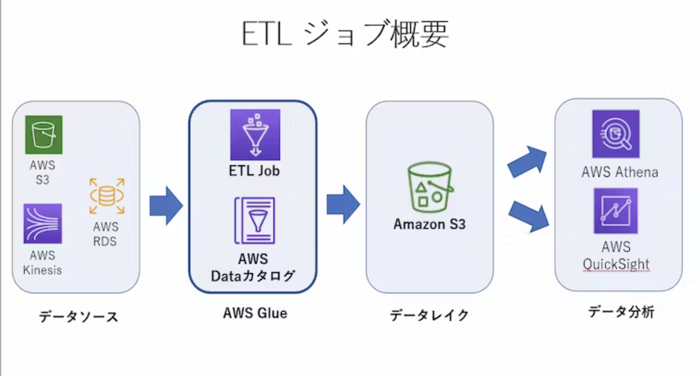
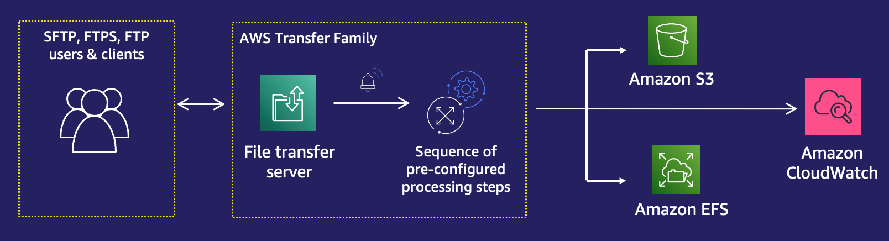

# 移行後アーキテクチャとアーキテクチャとモダナイゼーション
## クラウドジャーニー
移行後に、クラウドの最適化を進め、継続的な改善していくことをクラウドジャーニーと呼ぶ
## コンテナ
EC2にDockerサーバーを構築して運用することも可能だが、運用が煩雑になるため、コンテナ管理サービスを利用することが望ましい。コンテナオーケストレーションサービスとしてECSとEKS、アプリケーションをシンプルにデプロイするApp Runnerを解説する。

### ECS
ECRに保存したイメージを利用して、クラスタ、タスク定義、サービス設定を行うことでコンテナを管理することができる。
#### ECR
コンテナイメージをリポジトリという単位で管理することができる。
ECS/EKS/APpRunnerなどのコンテナ実行サービスから使用することができる。
#### クラスタ
コンテナを実行するサービスとタスクのグループであり、アクセス権限やコスト観点で分離する。
EC2タイプとFargateタイプのこの時点で選択する。
#### タスク定義
具体的なコンテナの中身に対する設定を行う。具体的にはコンテナイメージ、タスクサイズ、ポートや起動するコンテナに対するIAM Roleなどを定義する。
#### サービス
コンテナをどのように起動するかの設定を行う。具体的には、実行するタスク定義やコンテナを起動するVPCやSG、スケーリング設定、ALBとの接続などを設定する。
#### ネットワークモード
##### bridge (デフォルト)
説明: Dockerの標準的なブリッジネットワークモードを使用します。  

タスク内の各コンテナはホストインスタンス上のDockerブリッジ (docker0) を経由して通信します。
各タスクはホストインスタンス上での固有のポートマッピングを必要とします。このため、同じポートを使用する複数のタスクを同じホストインスタンス上で同時に実行することはできません。
ただし、8080ポートが利用されている場合、別のホストポート、例えば8081をマッピングして、内部的にはコンテナの8080にルーティングするように設定することは可能です。

##### host
説明: ホストのネットワークモードを使用します。

タスクのネットワークはEC2インスタンスのネットワークスタックを直接使用します。
タコンテナはホストのネットワークスタックを直接使用するため、コンテナ内のポートとホストのポートが直接一致します。

##### awsvpc
説明: タスクごとに独自のネットワークインターフェースを持つモードです。

各タスクは独自のENI (Elastic Network Interface) を持ち、プライベートIPアドレス, セキュリティグループ, ネットワークACLなどを持ちます。
各ECSタスクには独自のElastic Network Interface (ENI)が割り当てられ、そのENIには独自のプライベートIPアドレスが与えられます。このため、ホストインスタンス上でのポートの競合を心配する必要がありません。
Fargateでのタスク実行時や、VPC内での特定の通信ルールが必要な場合などに適しています。
タスク内のコンテナは同じネットワークインターフェースを共有します。

##### none
説明: タスク内のコンテナは外部のネットワークと通信しないモードです。

タスクが外部ネットワークと通信することはできません。
タスク内の通信は可能です。

#### Proton
コンテナのインフラ部分とサービス部分をテンプレートから作成することができるサービス。
- インフラ部分：環境テンプレート
    - VPC
    - IAM Role
    - ECSクラスタ
- サービス部分：サービステンプレート
    - ALB
    - ECSタスク
    - ECSサービス
    - ECR
    - CodePipeline

[公式ドキュメント](https://docs.aws.amazon.com/ja_jp/proton/latest/userguide/Welcome.html)

### EKS
コンテナのオーケストレーションサービスであるKubernetesのマネージドサービス。
オンプレミスから移行する際に利用することができ、AWSのELBやIAM、VPC、CloudTrailなどと統合されている。

### Amazon AppRunner
GithubやECRっと統合することによって、Appを継続的にデプロイ運用することができる。
起動するためのインフラの管理が全て不要になるため、インフラの知識なく簡単にアプリ開発とデプロイができる。

[参考ブログ](https://pages.awscloud.com/rs/112-TZM-766/images/BOS22_AWS-Builders-Online-Series_2022-Q3_Presentation-Deck.pdf)

### Amazon Managed Service for Prometheus
Prometheusというコンテナで構築されるマイクロサービス向けのモニタリングアラートサービスで、ECSとEKSと統合されている。
### Amazon Managed Service for Grafana
GrafanaはKibanaのようにさまざまなデータソースを可視化するサービスであり、Prometheusもデータソースとして利用できるため、ECSやEKSから得られたデータを可視化することができる。

## Kinesis
継続的に生成され続けるストリームデータについて、扱い処理するためのサービス。
### Kinesis Data Streams
ストリームデータを収集して順番通りにリアルタイム処理させることができる。
ConsumerはLambdaやECSなどが想定される。
データはシャードに割り振られて、シャードにより性能が決まるが、シャードを自動でスケールしてくれるオンデマンドモードが利用できる。

シャードを削減することで費用を削減できるが、シャードは1MB/secの制限がある点に注意
### Kinesis Data Firehose
大量のデータを指定した先へ配信する。AWSサービスであればS3やRedshiftなどに配信することができる。
配信タイミングは設定ができ、サイズが溜まったら配信したり、指定した時間が経過すると配信したりすることができる。
### Kinesis Data Analytics
Data StreamsやData Firehoseから配信されるデータをSQLを利用して分析し、分析結果を再度配信する。
### Kinesis Video Streams
動画に関する配信に特化したサービスで、Rekognitionなどと統合することで、分析をリアルタイムに行うことができる。
### MSK(Managed Streaming for Apache Kafka)
Kafkaのクラスターをマネージドに提供するサービス。VPCを指定して複数のAZにクラスタを起動させることができる。

## データレイク
データを大量に保存して、抽出分析することでビジネス戦略を得る必要があるが、その際のデータの保存先はメンテナンスが必要なく高い耐久性を求められる。
S3はこの要件を満たしていることに加えて様々なETLサービスや機械学習サービスと統合されているため、分析時に複製をする必要がなく、１データソース１データリソースにすることができるため、データレイクとして適切である。
### データレイク構築
#### Lake Formation
RDSやALB、CloudTrailからS3に配信するデータの内容に関しての制御を行うことができる。
#### Data Exchange
データプロバイダが配信しているデータをS3にインポートするためにデータの変換を行なってくれる。
#### AppFlow 
Salesfores/Slack/DatadogなどのデータをS3にインポートすることができる。
### データの処理
#### AWS Glue
フルマネージドのETLツールであり、データソースからターゲットに対してデータを変換して格納することができる。  

データソース(RDSやS3など)からクローラーがデータの構造を認識し、データカタログとしてまとめる。ジョブはデータカタログにまとめられたデータに対して処理を行い、ターゲット（S3など）に格納する。このプロセスによって、データレイクから分析しやすいデータ形式に変換することができる。

[参考サイト](https://and-engineer.com/articles/ZE8bQBEAAGqmqjHd)
### データ分析
#### Athena
S3に格納されたJSONやCSVのデータに対して、SQLを利用して分析を行うことができるサービス。
分析した、結果は事前指定したS3に格納され、その結果をQuickSightなどで可視化することもできる。

### データの利用
#### SageMaker
S3に蓄積されたデータを利用して独自のモデルを構築するための環境を提供するのがSageMakerである。  
Codingを行うためのJupter環境やラベリング支援のGound Truthなど、学習のためのサポートを受けることができる。  
構築したモデルはECRにPushされる
#### Comprehend（理解する）
文章を入力として、キーワード抽出やポジネガ判定をしてくれる。
#### Rekognition（認識）
動画を入力として、顔認証や物体認識をおこなってくれる。
#### Forecast（予報）
時系列データを入力として、将来予測をおこなってくれる。
#### Fraud Detector(詐欺)
不正アカウントやクレジットの不正利用を検知してくれる。
#### Kendra
S3やFSxを入力として、NLPによるラベリングを行なって検索を可能にしてくれる。
#### Translate
翻訳を行うサービス。
#### Polly
テキストを音声に変換するサービスで、男性や女性、ささやき声など様々なパターンに変換することができる。
#### Transcribe(書き起こす)
音声をテキストに変換することができるサービス。
#### Textract
OCR技術を利用して、画像からテキストを抽出する。
#### Lex
AIのチャットbotを提供するサービスで、Kendraと連携してFAQを構築することができる。

## Transfer Family
S3やEFSのデータをクライアントからSFTPなどを利用してDLしたい場合にはTransfer Familyを利用する。

[公式ドキュメント](https://docs.aws.amazon.com/ja_jp/transfer/latest/userguide/transfer-workflows.html)

## SES
### SESの送受信
Route53と組み合わせてMXレコードをSESに設定することでメッセージ受信することができる。
送信はLambdaからキックするような構成にすることで自動化することができる。
### Amazon Pinpoint
マーケティング分析に活用することができる。送信したメールに関して、届いた、見られた、リンクを踏まれたなどの情報を収集することができる。

## Egress-Only IGW
VPCではIPv6を使用することができる。IPv4ではインターネットに出て行くときはIGWを経由する。
IPv6ではEgress-Only IGWを利用する。  
Egressを利用する場合はVPCを新規作成し、IGWのようにVPCにアタッチして、ルートテーブルを設定する。

## 固定IPアドレス対応
外部接続先にIPのホワイトリスト設定があり、AWSからの接続についてIPを限定する必要がある場合の対応。
### NLB
EIPを取得したり、事前にホワイトリストに登録済みのIPをBYO IPとしてAWSに持ち込むことができます。
NLBには、AZごとにElasticIPを指定することができる。
### ENI
ENIにはプライベートIPやMACアドレス、セキュリティグループ、EIPなどを紐づけることができる。
事前にENIを作成し、必要情報を設定した後にEC2にアタッチさせることができる。

## 低遅延サービス
### AWS Outposts
AWSで利用しているハードウェア機器をオンプレミスに設定することができるサービス。
オンプレミス内でAWSサービスを利用することができるため、低遅延を実現できる。
### Local Zones
リージョンの拡張にあたる。主要なリージョンから物理的に離れた場所に位置する小さなデータセンターのようなもので、特定地域で利用することができる。
### Wavelongth
5Gネットワークへ直接データの送受信を行うことで低遅延を実現する。

## マネージドDBサービス
### Neptune
グラフの扱いに特化したDB
### DocumentDB
MongoDBとの互換性があり、DMSを利用してMongoDBからDocDBに移行することができる。
Jsonをそのまま格納できるといったメリットがある。
### Keyspaces
Apache Cassandra互換のDBで、Cassandraから移行する場合は選択肢に上がる。
### Timestream
時系列のデータを管理するのに特化したDBサービス。

## マネージドアプリケーションサービス
### AppSync
GraphQL APIを高速に開発することができる
### Device Farm
アプリケーションに対する複数のブラウザやデバイスからのテストを実行することができる。
アプリ開発をしていると複数のブラウザにおけるテストやモバイル（iphone/ipad/android)などからのテストが必要であるので、工数を削減できる。